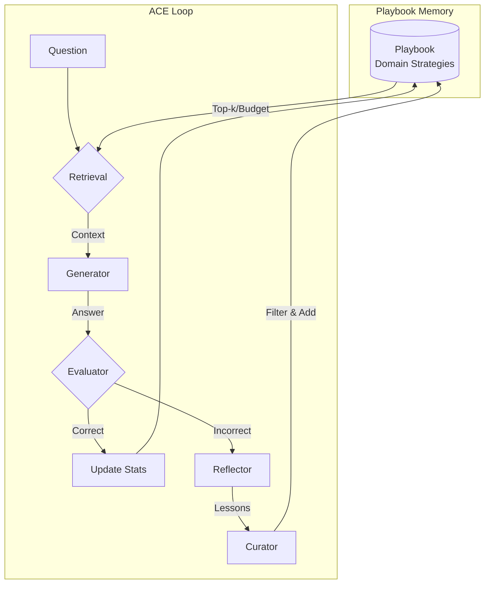

# TinyACE: Agentic Context Engineering for Small Language Models

<div align="center">

**Domain-Specific Benchmarking of Small Language Models on Edge Devices via Agentic Context Engineering**

[](https://opensource.org/licenses/Apache-2.0)
[](https://www.python.org/)
[](https://github.com/psf/black)

</div>

---

## 📖 Abstract

Small Language Models (SLMs) like Phi-3 and TinyLlama are efficient for edge deployment but often lack the reasoning depth of larger models. **TinyACE** (Agentic Context Engineering) is a framework that enables SLMs to "self-improve" without fine-tuning by maintaining a dynamic **Playbook Memory** of domain-specific strategies.

Instead of updating model weights, TinyACE evolves the prompt context through a feedback loop: **Generate → Reflect → Curate → Memorize**. This approach enables domain-specific adaptation while maintaining the efficiency benefits of small models.

### Key Contributions

- 🧠 **Playbook Memory System**: Dynamic accumulation of domain-specific strategies without fine-tuning
- 📊 **Retention Scoring**: Multi-component scoring formula for strategic forgetting
- 💾 **Token-Budgeted Memory**: Separate store capacity and prompt budget, so retrieval actually selects
- 🔬 **Ablation Support**: Each component switchable, including the control arm needed to attribute any effect
- 📈 **Model-Dependent Analysis**: Evaluation across Mistral 7B, Phi-3 Mini, TinyLlama 1.1B and Qwen2.5 rivals

> These describe what the framework implements. Which of them *helps* is an
> open question until the evaluation is redone -- see Status of Results below.

---

## 🎯 Status of Results

> **The previously published numbers have been withdrawn pending
> re-evaluation.** They were produced by a pipeline with defects that change
> the measurements themselves, not merely their presentation. The fixes are in
> this repository; the runs have not yet been redone.
>
> What went wrong, in order of impact:
>
> | | Defect | Effect |
> |---|---|---|
> | 1 | Gold answer was at option **(A) in 1000/1000** examples | Rewarded first-option bias, which differs between the terse baseline prompt and the verbose ACE prompt |
> | 2 | `fifo_memory` implemented **LIFO** | The "FIFO beats complex scoring" headline measured something else entirely |
> | 3 | OMA was **embedding-argmax over the full generation** | Answering with a letter -- which the prompt invites -- scored near-randomly |
> | 4 | Baseline and ACE differed in prompt, choices block, domain hints **and** answer parser | No delta could be attributed to the playbook |
> | 5 | `self_refine` was **shown the gold answer** in the prompt that produced its scored prediction | Measured copying, not reasoning |
> | 6 | **No seed anywhere**; two models decoded at temperature 0.7 | Runs were not reproducible |
> | 7 | n=50, no confidence intervals, no significance test | Every reported delta was 1-3 questions, inside a +/-12pp noise floor |
> | 8 | Ablations compared against **baseline** instead of full TinyACE | Under the correct reference, two of the four ablations changed *nothing* |
>
> See [CODE_REVIEW.md](CODE_REVIEW.md) for the full analysis and
> [docs/RESULTS.md](docs/RESULTS.md) for the withdrawn tables.

### Re-running the evaluation

```bash
# 1. Full grid, seeded, at a sample size that can resolve an effect
python -m scripts.run_eval_grid --config configs/experiment_grid.yaml --seed 42

# 2. Check every delta before believing it
python -m scripts.compare_arms --results-root results --reference cot_control

# 3. Ablations belong against full TinyACE, not against baseline
python -m scripts.compare_arms --results-root results --reference tinyace_wm_256
```

Repeat step 1 with at least three seeds and report mean +/- std.

### Arms

| Mode | What it is |
|---|---|
| `baseline` | Terse prompt, no playbook |
| `cot_control` | **The ACE prompt scaffold with an empty playbook.** The claim about the playbook is `ace - cot_control`, not `ace - baseline` |
| `ace` | Full system (`--ace-mode ace_full` or `ace_working_memory`) |
| `self_refine` | Critique-and-rewrite using only the model's own output |
| `self_refine_oracle` | Same, but shown the gold answer. An **upper bound**, not a baseline |

---

## 🏗️ System Architecture

TinyACE implements a feedback loop that freezes model weights but evolves the prompt context:



### Retention Scoring Formula

Lessons are scored and evicted based on:

$$S(l_i, t) = \alpha \cdot \frac{N_{succ}}{N_{used}+\epsilon} - \beta \cdot \frac{N_{fail}}{N_{used}+\epsilon} + \gamma \cdot e^{-\lambda(t-t_{last})} - \delta \cdot V(l_i)$$

Where:
- **Success Term** ($\alpha=1.0$): Rewards entries leading to correct answers
- **Failure Term** ($\beta=0.5$): Penalizes entries leading to incorrect answers
- **Recency Term** ($\gamma=0.3$): Bonus for recently used entries
- **Vagueness Term** ($\delta=0.4$): Penalty for generic/vague lessons

---

## 📂 Repository Structure

```
TINY ACE/
├── src/edge_slm_ace/          # Core package
│   ├── core/                  # ACE loop implementation
│   │   ├── ace_roles.py      # Generator, Reflector, Curator
│   │   └── runner.py          # Main evaluation loop
│   ├── memory/                # Playbook system
│   │   ├── playbook.py       # Retention scoring & eviction
│   │   └── relevance.py      # Query-conditioned retrieval
│   ├── models/                # Model management
│   └── utils/                  # Metrics, stats, config, seeding
├── scripts/                    # CLI tools
│   ├── run_experiment.py     # Single experiment runner
│   ├── run_eval_grid.py      # Grid experiment runner
│   ├── compare_arms.py       # CIs + paired significance testing
│   └── make_figures.py      # Visualization pipeline
├── configs/                    # Configuration files
│   └── experiment_grid.yaml   # Experiment configuration
├── docs/                       # Documentation
│   ├── ARCHITECTURE.md        # System design details
│   ├── RESULTS.md             # Withdrawn results, kept for provenance
│   └── guides/                # User guides
├── data/                       # Datasets
└── tests/                      # Test suite
```

---

## 🚀 Quick Start

### Installation

```bash
# Clone repository
git clone https://github.com/SirAlchemist1/edge-slm-ace.git
cd edge-slm-ace

# Create virtual environment
python -m venv venv
source venv/bin/activate  # On Windows: venv\Scripts\activate

# Install dependencies
pip install -r requirements.txt
pip install -e .
```

### Run a Single Experiment

```bash
# Baseline evaluation
python -m scripts.run_experiment \
  --model-id microsoft/Phi-3-mini-4k-instruct \
  --task-name sciq_test \
  --mode baseline \
  --device cuda

# ACE Working Memory (256 token budget)
python -m scripts.run_experiment \
  --model-id microsoft/Phi-3-mini-4k-instruct \
  --task-name sciq_test \
  --mode ace \
  --ace-mode ace_working_memory \
  --token-budget 256 \
  --device cuda
```

### Run Full Evaluation Grid

```bash
# Run all experiments (models × tasks × modes)
python -m scripts.run_eval_grid --config configs/experiment_grid.yaml

# Dry run (preview commands)
python -m scripts.run_eval_grid --config configs/experiment_grid.yaml --dry-run
```

### Generate Visualizations

```bash
# Generate all plots from results
python -m scripts.make_figures

# Custom paths
python -m scripts.make_figures --results_dir results --output_dir plots
```

### Run Qwen2.5 Rival Experiments

Compare TinyACE against Qwen2.5 models (parameter-matched rivals to TinyLlama, Phi-3, and Mistral-7B):

```bash
# Run all Qwen2.5 rival experiments
python -m scripts.run_qwen_rivals

# Or use the shell script
python -m scripts.run_qwen_rivals

# Dry run (preview what would be run)
python -m scripts.run_qwen_rivals --dry-run

# Run only specific model classes
python -m scripts.run_qwen_rivals --model-class small   # ~1-2B models
python -m scripts.run_qwen_rivals --model-class medium  # ~3-4B models
python -m scripts.run_qwen_rivals --model-class large   # ~7B models

# Run specific models only
python -m scripts.run_qwen_rivals --models qwen-2.5-3b phi-3-mini

# Run on different device
python -m scripts.run_qwen_rivals --device cpu
```

**Output artifacts:**
- `results/qwen_rivals/results_models_qwen.json` - Summary metrics
- `results/qwen_rivals/results_stability_qwen.csv` - Per-example stability data
- `results/qwen_rivals/figures/sweetspot_qwen_bar.{pdf,png}` - Comparison bar chart
- `results/qwen_rivals/figures/stability_curves_qwen.{pdf,png}` - Accuracy over time
- `paper_snippets/qwen_rivals_table.tex` - LaTeX table for paper
- `paper_snippets/qwen_rivals_summary.tex` - LaTeX summary text

---

## ⚙️ Configuration

Edit `configs/experiment_grid.yaml` to customize experiments:

```yaml
models:
  - name: phi-3-mini
    hf_id: microsoft/Phi-3-mini-4k-instruct

modes:
  - name: baseline
  - name: tinyace_wm_256
    ace_mode: ace_working_memory
    working_memory_token_budget: 256
  - name: tinyace_fifo
    fifo_memory: true  # Use FIFO eviction

devices:
  - cuda  # NVIDIA GPU
  - mps   # Apple Silicon
```

See [configs/experiment_grid.yaml](configs/experiment_grid.yaml) for all options.

---

## 📊 Experimental Results

The previous model-comparison and ablation summaries have been removed from
this README rather than reproduced with caveats, because each was derived from
the defective measurements listed under [Status of Results](#-status-of-results)
above. Reproducing them here, even hedged, would keep numbers in circulation
that should not be cited.

The withdrawn tables remain in [docs/RESULTS.md](docs/RESULTS.md), annotated
in place with what was wrong with each.

To generate replacements, see [Re-running the evaluation](#re-running-the-evaluation).

---

## 📚 Documentation

- **[Architecture Guide](docs/ARCHITECTURE.md)** - Complete system design and implementation
- **[Results Analysis](docs/RESULTS.md)** - Detailed experimental findings
- **[Plotting Guide](PLOTTING_GUIDE.md)** - Visualization instructions
- **[Documentation Index](docs/README.md)** - Full documentation index

---

## 🔬 Key Features

- ✅ **Five Evaluation Modes**: Baseline, CoT control, ACE Full, ACE Working Memory, Self-Refine
- ✅ **Token-Budgeted Memory**: Strategic forgetting for edge devices
- ✅ **Retention Scoring**: Multi-component scoring system
- ✅ **Ablation Support**: Systematic component analysis
- ✅ **Multi-Device Support**: CPU, CUDA, MPS (Apple Silicon)
- ✅ **Query-Conditioned Retrieval**: Lessons ranked against the question, not just the domain
- ✅ **Honest Metrics**: OMA with Wilson intervals, paired McNemar tests, seeded runs with captured environments

---

## 📝 Citation

If you use this codebase in your research, please cite:

```bibtex
@software{tinyace2024,
  title={TinyACE: Domain-Specific Benchmarking of Small Language Models for Edge Devices with Agentic Context Engineering},
  author={Shahi, Suryodaya and Sathwik and Archit},
  year={2026},
  url={https://github.com/SirAlchemist1/edge-slm-ace},
  note={Workshop Paper}
}
```

**Paper**: See `TinyAce Paper.pdf` for the full technical report.

---

## 📄 License

This project is licensed under the Apache License 2.0 - see the [LICENSE](LICENSE) file for details.

---

## 🙏 Acknowledgments

- HuggingFace for model hosting and transformers library
- The open-source community for tools and libraries

---

## 📧 Contact

For questions or issues, please open an issue on GitHub or contact the maintainers.

---

## 📖 Paper

The full technical report is available as `TinyAce Paper.pdf` in the repository root.

**Paper Title**: "Domain-Specific Benchmarking of Small Language Models for Edge Devices with Agentic Context Engineering (ACE)"

---

<div align="center">

**Made with ❤️ for the edge AI community**

[Report Issue](https://github.com/SirAlchemist1/edge-slm-ace/issues) · [Request Feature](https://github.com/SirAlchemist1/edge-slm-ace/issues) · [Documentation](docs/README.md)

</div>
