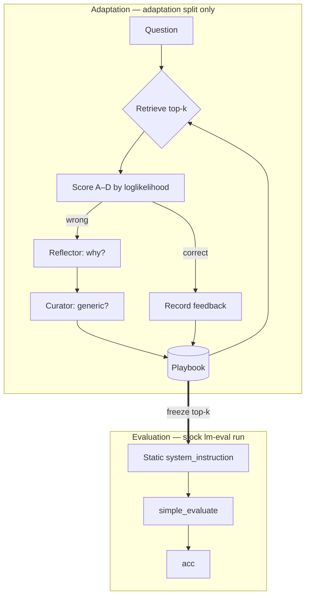

# TinyACE-Nepali

**Test-time context adaptation for small language models on a low-resource language**

[](https://opensource.org/licenses/Apache-2.0)
[](https://www.python.org/)
[](https://github.com/psf/black)

---

## What this is

Can a small language model get better at a task without touching its weights,
by accumulating a **playbook** of strategies it writes for itself — and does
that still work in a language it barely reads?

TinyACE builds a playbook on an adaptation split (score → reflect on errors →
curate → memorise), **freezes it**, and then evaluates through a stock
[lm-evaluation-harness](https://github.com/EleutherAI/lm-evaluation-harness) run
with the playbook as a static prompt prefix. The task is
[Belebele](https://huggingface.co/datasets/facebook/belebele) reading
comprehension, in English (`eng_Latn`) and Nepali (`npi_Deva`) — 900 parallel
questions, the same items in both, which makes the cross-lingual comparison
paired rather than merely matched.

The design constraint that shapes everything here: **nothing this project owns
is allowed to compute a reported number.** Adaptation is the only loop we
control, and it sees the adaptation split only. Scoring is the harness's — no
answer parsing, no option mapping, no bespoke accuracy.

## Status

> **No results yet.** The numbers from the previous version of this project were
> withdrawn (see [docs/results.md](docs/results.md) and `CHANGELOG.md`), the
> pipeline was rebuilt around the harness, and the runs have not been redone.
>
> Nothing in this repository should be read as a finding until `make screen`,
> `make grid` and `make report` have been run and the deltas have survived
> `scripts/compare_arms.py`.

## Install

```bash
git clone https://github.com/SirAlchemist1/edge-slm-ace.git
cd edge-slm-ace
make install          # pip install -e ".[dev,retrieval,report]"
make data             # verify the committed Belebele files
make test
```

The `retrieval` extra provides the multilingual sentence encoder used to rank
lessons against the question. Without it, retrieval falls back to
question-independent ranking — it says so loudly, and `metrics.json` records
`relevance_active: false`, but the run completes.

See [docs/installation.md](docs/installation.md) for devices and troubleshooting.

## Run

```bash
# 1. Screening gate. A model enters the grid only if the lower bound of its
#    Wilson interval on Nepali clears 30% (chance is 25%). Pre-registered.
make screen DEVICE=cuda

# 2. Every arm, both languages, one seed. Loads each model once.
make grid DEVICE=cuda

# 3. Aggregate, then test every delta for significance.
make report
```

The results layout carries no seed segment, so a multi-seed study needs one root
per seed:

```bash
make grid SEED=42 RESULTS=results/seed42
make grid SEED=43 RESULTS=results/seed43
```

One cell at a time:

```bash
python -m scripts.run_arm --model qwen3-1.7b --language ne --arm tinyace \
  --output-dir results/qwen3-1.7b/ne/tinyace --device cuda
```

## Arms

| Arm | What it is |
|---|---|
| `baseline` | The bare task prompt. No instruction prefix at all. |
| `scaffold_control` | The identical instruction prefix over an **empty** playbook. **The playbook claim is `tinyace − scaffold_control`, not `tinyace − baseline`.** |
| `tinyace` | Scaffold plus a playbook adapted on the adaptation split and frozen before evaluation. |
| `tinyace_equal_lessons` | Same playbook, more lessons in the prefix. Tests whether Devanagari fertility, not lesson quality, is the binding constraint. |
| `tinyace_playbook_en` | Nepali questions, English playbook. Do the lessons have to be in the question's language? |
| `tinyace_ablate_no_curator` | Skip the Curator screening pass. |
| `tinyace_ablate_no_relevance` | Retention-only ranking; every question sees the same lessons. |
| `tinyace_ablate_no_vagueness` | δ = 0. |
| `tinyace_ablate_no_recency` | γ = 0. |
| `tinyace_ablate_no_failure` | β = 0. |
| `tinyace_fifo` | Oldest-first eviction instead of lowest-score. Eviction only — retrieval still ranks by retention, so the ablation isolates one thing. |

**Ablations are compared against `tinyace`, not against `baseline`.** Comparing
an ablation to baseline measures ACE *plus* the ablation rather than the ablated
component. `reporting/schema.py` owns that mapping and `compare_arms` applies it.

Two arms are registered but have no runner and are marked `implemented=False`:
`tinyace_retrieval` (per-question retrieval needs per-item scoring, not a static
prefix) and `generative_cot`. `run_arm` refuses them by name rather than writing
another arm's result under their label.

## How it works



Adaptation decides "was this right?" the same way evaluation does — the
loglikelihood of the letters A–D, through the same `HFLM`, with a context
assembled by lm-eval's own helpers. `assert_matches_harness()` and a golden test
check that byte for byte in both chat-template and completion modes; a drift
there would tune the playbook against one rendering and score it against
another.

### Retention scoring

A lesson's retention score, used for retrieval ranking and for eviction:

```
S(l, t) = α·(N_succ/(N_used+ε)) − β·(N_fail/(N_used+ε)) + γ·exp(−λ·(t−t_last)) − δ·V(l)
```

`V(l)` is a vagueness heuristic over the lesson text. Each of β, γ, δ has an
ablation arm. Retrieval blends this with cosine relevance to the question;
`--relevance-weight 0` reproduces retention-only ranking.

## Reading a result

Three things decide whether a difference is real, and all three ship with the
run:

- **Intervals.** At n=500 the 95% Wilson halfwidth near 40% is about 4.3 points.
  `summary_accuracy.csv` carries `ci_halfwidth` next to every accuracy.
- **A paired test.** The arms answer identical questions, so the comparison is
  McNemar's on the discordant pairs, not two independent proportions.
- **A correction.** Ten arms against a reference is ten tests; at α=0.05 the
  chance of at least one false positive under the null is about 40%. Every
  comparison printed together is one Holm-corrected family, and the adjusted
  p-value is the one that decides.

`scripts/compare_arms.py` does all three. A delta that has not been through it
is not a result.

### Health checks that invalidate a run

- **Truncation.** lm-eval truncates an over-long prompt *from the left*, and the
  Belebele prompt opens with the passage. A longer prefix truncates more, so the
  ACE arms clip more than baseline on the same items — an arm-asymmetric
  confound, not noise. `truncated_prompts` travels with every result and
  `aggregate_results` warns on it.
- **Relevance backend.** `relevance_active: false` means retrieval was not
  query-conditioned, whatever `--relevance-weight` said.
- **Item-set mismatch.** `per_item_correctness` verifies the harness scored the
  ids that were requested, and raises otherwise.

## Known limitations

- The frozen prefix is **static across the evaluation split**. A playbook cannot
  be retrieved per question through `system_instruction`, so query-conditioned
  retrieval is measurable during adaptation only. That is a property of the
  loglikelihood track, not a bug, and `tinyace_retrieval` exists to measure it
  once there is a runner for it.
- `GENERIC_PHRASES` is English-only, so the phrase term of the vagueness score
  is inert on Nepali lessons and δ rests on length alone there. A cross-lingual
  delta must not be read as an effect of the playbook while that stands.
- Credit for a correct answer is uniform over the lessons that were retrieved.
  The model emits no text at scoring time, so there is no citation to attribute
  by; the success/failure counts are weak per-lesson evidence.

## Repository layout

```
src/edge_slm_ace/
  adapt.py            The adaptation loop. The only loop this project owns.
  core/ace_roles.py   Reflector and Curator prompts, and their parsers.
  data/belebele.py    Loading, the id join, and the study's one split.
  harness/            Prompt parity, option scoring, the frozen eval.
  memory/             The playbook: retention scoring, eviction, retrieval.
  eval/stats.py       Wilson, exact McNemar, Holm. Standard library only.
  reporting/          Results layout, arm registry, aggregation.
  utils/              Model registry, split sizes, seeding, environment capture.
scripts/              Thin CLIs: fetch, screen, run one arm, run the grid, report.
data/tasks/belebele/  The two committed language files.
```

## Documentation

| | |
|---|---|
| [docs/installation.md](docs/installation.md) | Environment setup |
| [docs/quickstart.md](docs/quickstart.md) | First run |
| [docs/architecture.md](docs/architecture.md) | The loop, the playbook, the harness boundary |
| [docs/evaluation.md](docs/evaluation.md) | **The protocol.** Read before reporting any number |
| [docs/api.md](docs/api.md) | Package reference |
| [docs/results.md](docs/results.md) | Withdrawn results, kept for provenance |
| `CHANGELOG.md` | Every defect found, and its fix |

## Citation

```bibtex
@software{tinyace_nepali,
  title  = {TinyACE-Nepali: Test-Time Context Adaptation for Small Language
            Models on a Low-Resource Language},
  author = {Shahi, Suryodaya},
  year   = {2026},
  url    = {https://github.com/SirAlchemist1/edge-slm-ace}
}
```

## License

Apache 2.0 — see [LICENSE](LICENSE).
